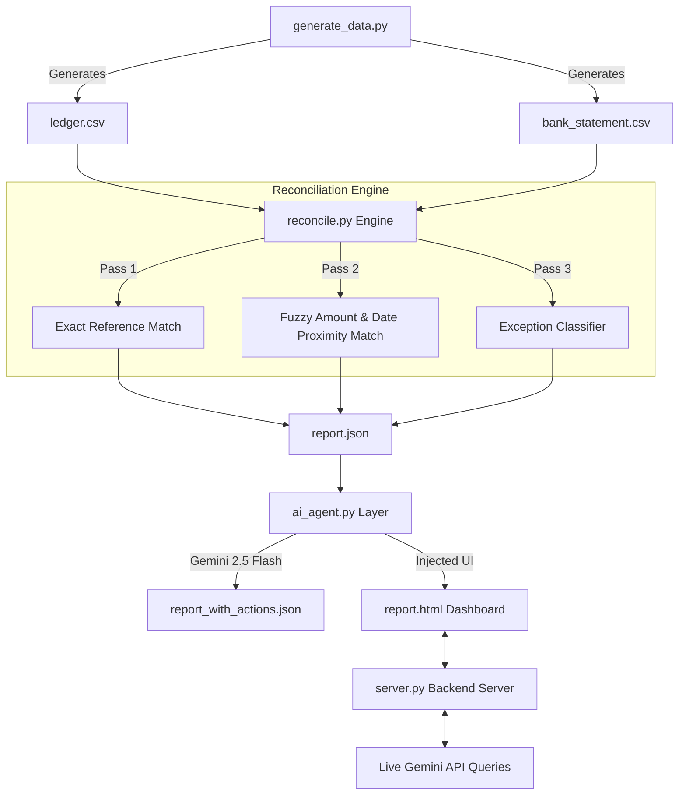

# ⚡ ReconMate — AI-Powered Financial Reconciliation Agent

[](https://www.python.org/)
[](https://aistudio.google.com/)
[](LICENSE)

> **ReconMate** is an intelligent, automated financial reconciliation engine and AI agent designed for payment platforms like **Razorpay**. It bridges the gap between merchant ledgers and bank settlement statements using a two-pass deterministic matching pipeline combined with an LLM reasoning layer powered by **Google Gemini**.

---

## 🌟 Key Highlights

- 🔍 **Two-Pass Reconciliation Engine**:
  - **Pass 1 (Exact Match)**: Matches transactions via unique references in bank narrations while validating fee tolerances.
  - **Pass 2 (Fuzzy Match)**: Resolves settlement delays (1–3 days) and payment gateway fee deductions (0–4%) when reference numbers are missing or obscured.
- 🚨 **Honest Exception Classification**: Transparently flags anomalies instead of hiding them:
  - `AMOUNT_MISMATCH` (e.g., unrecorded partial refunds, unexpected fee adjustments)
  - `MISSING_SETTLEMENT` (payments in transit or failed settlements)
  - `DUPLICATE_SETTLEMENT` (duplicate bank credits)
  - `UNEXPLAINED_BANK_CREDIT` (bank credits missing from merchant ledgers)
- 🤖 **Gemini AI Agent Layer**:
  - Automatically synthesizes an **Executive Summary** for finance managers.
  - Prescribes **Concrete Next Steps** for every exception.
  - Drafts **ready-to-send messages** for operations teams, banks, or merchants.
  - **Fallback Resilience**: Falls back to deterministic rule-based generation if offline or rate-limited.
- 🌐 **Interactive Live Dashboard & Backend**:
  - Dark-mode responsive web interface with live stats and tables.
  - Embedded **Interactive Gemini Assistant** allowing natural language queries on reconciliation data.
  - **One-Click Re-run**: Re-trigger synthetic data generation, matching, and AI evaluation on demand.

---

## 🏗️ Architecture & Workflow



---

## 📁 Repository Structure

```
├── .env.example              # Environment variables template
├── .gitignore                # Git ignore rules (protects secrets)
├── README.md                 # Project documentation
├── requirements.txt          # Python dependencies
├── generate_data.py          # Synthetic dataset generator (65+ records)
├── reconcile.py              # Two-pass reconciliation engine
├── ai_agent.py               # Google Gemini AI agent layer
├── server.py                 # Interactive HTTP server & API backend
├── ledger.csv                # Sample Razorpay-side payment ledger
├── bank_statement.csv        # Sample Bank settlement statement
├── report.json               # Raw reconciliation matching results
├── report_with_actions.json  # Enriched report with Gemini AI actions
└── report.html               # Interactive web dashboard
```

---

## 🚀 Quick Start Guide

### 1. Clone the Repository
```bash
git clone https://github.com/kumaradi9508/reconmate-ai-agent.git
cd reconmate-ai-agent
```

### 2. Install Dependencies
```bash
pip install -r requirements.txt
```

### 3. Configure Gemini API Key
Create a `.env` file in the root directory (or copy from `.env.example`):
```bash
cp .env.example .env
```
Add your Google Gemini API key:
```env
GOOGLE_API_KEY="your-gemini-api-key-here"
PORT=8000
```
*(Get a free API key at [Google AI Studio](https://aistudio.google.com/apikey))*

### 4. Run the Pipeline
Execute the full reconciliation pipeline end-to-end:

```bash
# Step 1: Generate synthetic transaction data
python generate_data.py

# Step 2: Reconcile ledger against bank statements
python reconcile.py

# Step 3: Run Gemini AI Agent analysis
python ai_agent.py
```

### 5. Launch the Interactive Dashboard
Start the local server:
```bash
python server.py
```
Open **[http://localhost:8000](http://localhost:8000)** in your browser to view the interactive dashboard!

---

## 📊 Dashboard Preview & Features

- **Summary Cards**: Real-time Match Rate (%), Amount Reconciled (₹), Exceptions Count.
- **Matched Transactions Table**: Exact vs Fuzzy match breakdowns with deducted fee calculations.
- **Exceptions Table**: Anomaly type, transaction ID / bank reference, and detailed reason.
- **AI Action Center**: Action items and draft communications synthesized by Gemini.
- **Live Gemini Chat Assistant**: Ask ad-hoc questions regarding any settlement or transaction directly in the UI.

---

## 🔌 API Endpoints

The built-in server (`server.py`) provides the following REST endpoints:

| Endpoint | Method | Description |
| :--- | :--- | :--- |
| `/` or `/report.html` | `GET` | Serves the interactive reconciliation UI |
| `/api/status` | `GET` | Health check and Gemini connection status |
| `/api/data` | `GET` | Returns `report_with_actions.json` data |
| `/api/reconcile` | `POST` | Re-executes the pipeline and returns fresh results |
| `/api/ask` | `POST` | Queries Gemini with context from the reconciliation report |

---

## 📄 License

This project is licensed under the MIT License - see the [LICENSE](LICENSE) file for details.

---

### 👨‍💻 Author
- **Aditya Kumar** - [GitHub](https://github.com/kumaradi9508)
