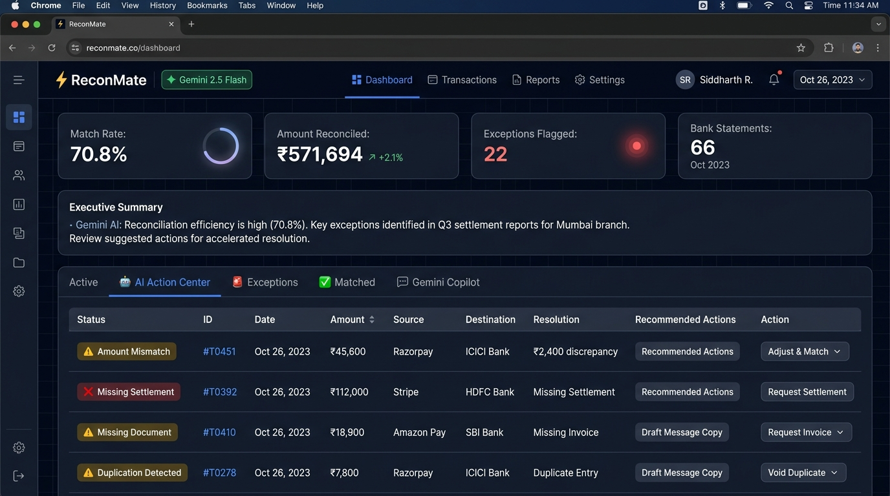
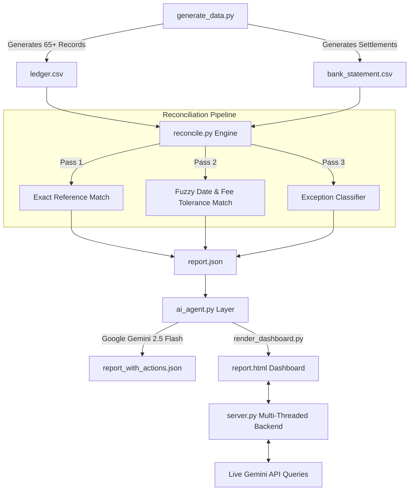

# ⚡ ReconMate — AI-Powered Financial Reconciliation Agent

[](https://www.python.org/)
[](https://aistudio.google.com/)
[](LICENSE)
[](https://github.com/kumaradi9508/reconmate-ai-agent)

> **ReconMate** is an intelligent, automated financial reconciliation engine and AI agent designed for payment platforms like **Razorpay**. It bridges the gap between merchant transaction ledgers and bank settlement statements using a two-pass deterministic matching pipeline combined with an autonomous LLM reasoning layer powered by **Google Gemini**.

---

## 📊 Interactive Dashboard Preview



---

## 🌟 Key Highlights

- 🔍 **Two-Pass Deterministic Reconciliation Engine**:
  - **Pass 1 (Exact Match)**: Matches transactions via unique reference numbers in bank narration text while enforcing gateway fee tolerances (0–4%).
  - **Pass 2 (Fuzzy Match)**: Resolves settlement timing delays (1–3 business days) and payment gateway fee deductions when reference numbers are missing or truncated.
- 🚨 **Honest Exception Classification**: Transparently flags and categorizes anomalies:
  - `AMOUNT_MISMATCH` (e.g., unrecorded partial refunds, unexpected fee adjustments)
  - `MISSING_SETTLEMENT` (payments in transit or failed gateway settlements)
  - `DUPLICATE_SETTLEMENT` (duplicate bank credits / potential double payouts)
  - `UNEXPLAINED_BANK_CREDIT` (bank credits missing from merchant ledgers)
- 🤖 **Gemini AI Agent Reasoning Layer**:
  - Automatically synthesizes an **Executive Summary** for finance leaders.
  - Prescribes **Concrete Next Steps** for every exception.
  - Drafts **ready-to-dispatch communications** (1-click copy) for bank ops, merchants, and finance teams.
  - **Fallback Resilience**: Multi-model fallback (`gemini-2.5-flash`, `gemini-1.5-flash`, `gemini-2.0-flash`) with contextual rule-based reasoning if offline.
- 🌐 **Interactive Live Dashboard & Backend**:
  - Dark-mode responsive fintech UI with real-time KPI metrics and search filters.
  - Embedded **Interactive Gemini Copilot** allowing natural language queries on reconciliation data.
  - **One-Click Re-run**: Re-trigger synthetic data generation, matching, and AI evaluation directly from the UI.

---

## 🏗️ Architecture & Workflow



---

## 📁 Repository Structure

```
├── .env.example              # Environment variables template
├── .gitignore                # Git ignore rules (protects API keys)
├── LICENSE                   # MIT License
├── README.md                 # Project documentation & walkthrough
├── requirements.txt          # Python dependencies
├── generate_data.py          # Synthetic dataset generator (65+ records)
├── reconcile.py              # Two-pass reconciliation engine
├── ai_agent.py               # Google Gemini AI agent layer
├── render_dashboard.py       # Modern dark-mode dashboard HTML generator
├── server.py                 # Multi-threaded server with live Gemini endpoints
├── ledger.csv                # Sample Razorpay-side payment ledger
├── bank_statement.csv        # Sample Bank settlement statement
├── report.json               # Raw reconciliation matching results
├── report_with_actions.json  # Enriched report with Gemini AI actions
├── report.html               # Interactive web dashboard
└── assets/
    └── dashboard.png         # High-resolution dashboard screenshot
```

---

## 🚀 Quick Start Guide

### 1. Clone the Repository
```bash
git clone https://github.com/kumaradi9508/reconmate-ai-agent.git
cd reconmate-ai-agent
```

### 2. Install Dependencies
```bash
pip install -r requirements.txt
```

### 3. Configure Gemini API Key
Create a `.env` file in the root directory (or copy from `.env.example`):
```bash
cp .env.example .env
```
Add your Google Gemini API key:
```env
GOOGLE_API_KEY="your-gemini-api-key-here"
PORT=8000
```
*(Get a free API key at [Google AI Studio](https://aistudio.google.com/apikey))*

### 4. Run the Pipeline (CLI)
Execute the reconciliation pipeline end-to-end:

```bash
# Step 1: Generate synthetic transaction data (65+ records)
python generate_data.py

# Step 2: Reconcile ledger against bank statements
python reconcile.py

# Step 3: Run Gemini AI Agent analysis
python ai_agent.py
```

### 5. Launch the Interactive Dashboard
Start the local server:
```bash
python server.py --open
```

Open either link in your browser:
- **Localhost**: [http://localhost:8000](http://localhost:8000)
- **Direct IP**: [http://127.0.0.1:8000](http://127.0.0.1:8000)

---

## 💡 Troubleshooting: Localhost Not Opening?

If `http://localhost:8000` is not opening on your computer, check the following:

1. **Make sure the server is running:**
   ```bash
   python server.py
   ```
   Keep the terminal window open while viewing the dashboard.

2. **Try the direct IP link instead of localhost:**
   On some Windows installations, `localhost` resolves to IPv6 (`::1`). Open **[http://127.0.0.1:8000](http://127.0.0.1:8000)** directly in your browser.

3. **Port 8000 already in use?**
   `server.py` automatically detects occupied ports and binds to the next available port (`8001`, `8002`, etc.), displaying the exact active URL in the terminal. You can also specify a custom port:
   ```bash
   python server.py --port 8080
   ```

4. **View without running a server:**
   You can double-click `report.html` to open the full dashboard statically in any web browser (`file:///.../report.html`).

---

## 🔌 REST API Endpoints

The built-in multi-threaded server (`server.py`) provides the following endpoints:

| Endpoint | Method | Description |
| :--- | :--- | :--- |
| `/` or `/report.html` | `GET` | Serves the interactive reconciliation UI dashboard |
| `/api/status` | `GET` | Health check, server status, and Gemini connection info |
| `/api/data` | `GET` | Returns `report_with_actions.json` structured data |
| `/api/reconcile` | `POST` | Re-executes the full pipeline and returns fresh results |
| `/api/ask` | `POST` | Queries Gemini Copilot with live context from the reconciliation report |

---

## 📄 License

This project is licensed under the MIT License - see the [LICENSE](LICENSE) file for details.

---

### 👨‍💻 Author
- **Aditya Kumar** - [GitHub Profile](https://github.com/kumaradi9508)
